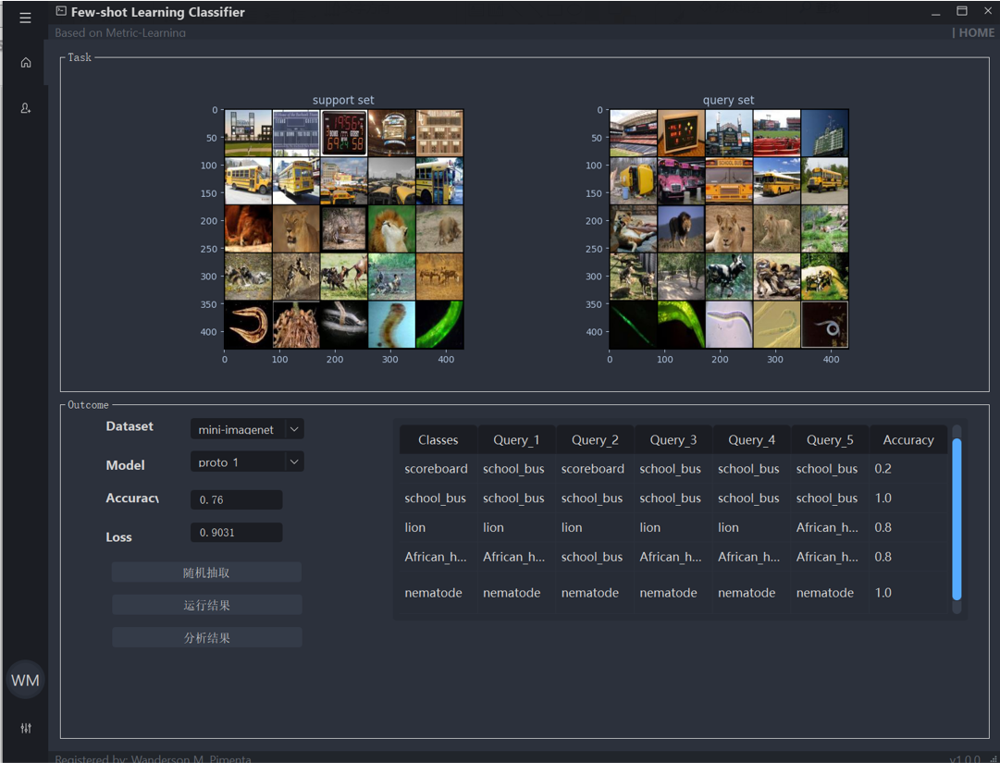

# Few-shot Classification System based on PyQt

> **Warning**: use PySide2 and PyQt5 in version 5.15.2 or > (**pip install pyside2==5.15.2**)!




# REQUERIMENTS:
> ```sh
> ```
> PySide2 and PyQt5 in version 5.15.1
> torch == 1.12.0
> matplotlib
> psycopg2-binary==2.8.5
> numpy==1.18.1
> Pillow==9.2.0
> scikit-learn==1.0.2
> scipy==1.7.3

# RUN FILE:
main.py